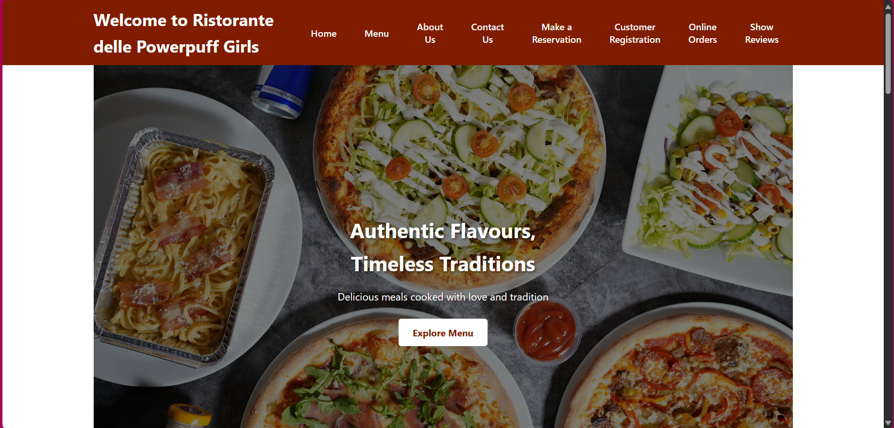
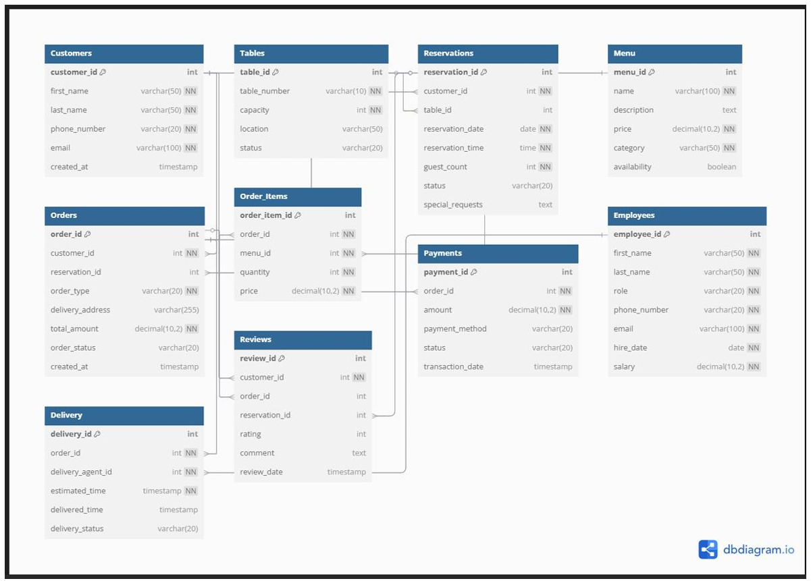

Restaurant Management System

The Restaurant Management System is a full-stack application designed to streamline the day-to-day operations of a restaurant. It combines a robust backend powered by Node.js, Express, and Microsoft SQL Server with a user-friendly frontend built using HTML, CSS, and JavaScript. The system allows restaurant staff to efficiently manage customers, reservations, and orders, while keeping all records securely stored in a centralized database. With a clean project structure and environment-based configuration, it provides an organized and scalable foundation for restaurant operations. This system can serve as a starting point for more advanced applications, such as integrating payment processing, role-based access, and analytics dashboards for business insights.

Homepage  

Features:
1. Backend built with Node.js, Express, and MSSQL
2. Frontend interface using HTML, CSS, and JavaScript
3. Secure database connection through environment variables (.env)
4. Clear project structure separating backend and frontend

Tech Stack:
1. Backend: Node.js, Express, MSSQL
2. Frontend: HTML, CSS, JavaScript
3. Database: SQL Server

ER-Diagram  

